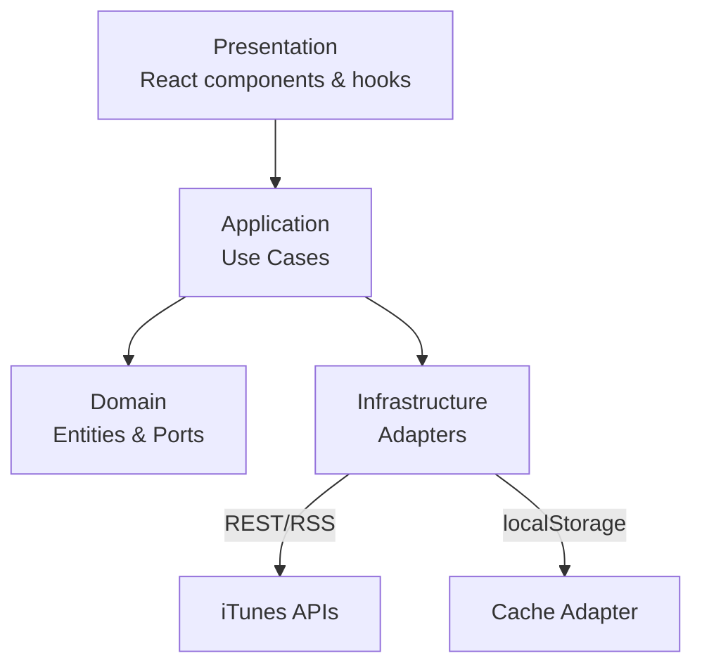

# Inditex Technical Test

## Reviewer Summary
- React 19 + TypeScript SPA built from scratch with Webpack, native CSS, and ESLint 9.
- Hexagonal architecture throughout (Domain → Application → Infrastructure → Presentation) with 24-hour localStorage cache and SWR orchestration.
- Automated quality gates: Husky (lint + prettier), Commitlint, Jest unit suite, Cypress headless e2e flow.
- RSS feed parsing hardened with namespace injection and proxy-first strategy; Cypress specs isolated from the TypeScript app build.

## How to Evaluate
> **Prerequisites:** Node.js ≥ 18, npm ≥ 9. Total setup ≈ 3 minutes. For Cypress, keep the dev server running.

1. **Install dependencies**  
   ```bash
   npm install
   npm run prepare   # install Husky hooks
   ```
2. **Run the app (development)**  
   ```bash
   npm run dev
   ```  
   Serves `http://localhost:5173` with HMR. *(Keep running for e2e tests.)*
3. **Run unit/integration tests**  
   ```bash
   npm test
   ```  
   Runtime ≈ 5 seconds.
4. **Run Cypress smoke suite**  
   ```bash
   npm run test:e2e
   ```  
   Requires the dev server from step 2. Runtime ≈ 25 seconds.
5. **Produce a production bundle**  
   ```bash
   npm run build
   ```  
   Outputs minified assets to `dist/` (≈ 4 seconds).
6. *(Optional)* **Inspect coverage**  
   ```bash
   npm test -- --coverage
   ```

## Architecture Overview



| Layer / Directory | Purpose |
| ----------------- | ------- |
| `src/app`         | App shell, router mount, global providers. |
| `src/core`        | SWR provider, router, config wiring. |
| `src/features/podcasts/domain` | Entities, value objects, repository contracts, domain services. |
| `src/features/podcasts/application` | Use cases, DTOs, application services, mappers (Domain→DTO). |
| `src/features/podcasts/infrastructure` | HTTP clients, RSS feed parser, cache adapters, mappers (API→Domain). |
| `src/features/podcasts/presentation` | React components, pages, custom hooks. |
| `src/shared`      | Reusable infrastructure adapters, shared UI, utilities. |
| `src/tests/__e2e__` | Cypress specs (excluded from app TypeScript build). |

### Architecture Documentation

For a detailed explanation of the hexagonal architecture components, see:
- **[Componentes de Arquitectura](./docs/componentes-arquitectura.md)** - Detailed explanation of DTOs, mappers, services, and how they form part of the hexagonal architecture.
- **[Ports y Adapters](./docs/ports-adapters.md)** - Simple explanation of ports and adapters pattern with real examples from the project.
- **[Inyección de Dependencias](./docs/inyeccion-dependencias.md)** - Simple explanation of dependency injection with practical examples from the project.
- **[Patrones de Diseño y Arquitecturas](./docs/patrones-diseño-arquitecturas.md)** - Complete list of design patterns and architectures applied in the project.
- **[Arquitectura del Proyecto](./docs/arquitectura.md)** - Complete architecture documentation with implementation guidelines.

## Key Decisions & Trade-offs
- **SWR for data orchestration:** Keeps hooks declarative while respecting domain boundaries; paired with 24h TTL localStorage cache.
- **Proxy-first RSS strategy:** Always hits AllOrigins first to satisfy CORS, falling back to direct fetch for resilience.
- **Manual namespace injection in RSS parser:** Guarantees `content:encoded` and `itunes:*` nodes survive DOM parsing without external dependencies.
- **tsconfig isolation for Cypress:** Prevents Chai matchers from leaking into Jest by excluding `*.test.ts(x)` and e2e specs from the application compiler.
- **Strict tooling:** Husky enforces lint + prettier on each commit; Commitlint maintains Conventional Commits for readable history.
- **Webpack dual modes:** `mode: development` (no minification, inline source maps) vs `mode: production` (minified bundles, splitChunks).

## Testing Strategy
- **Unit & integration (Jest-only):**
  - Application use cases (`GetTopPodcasts`, `GetPodcastDetail`, `FilterPodcasts`).
  - Infrastructure adapters (`FeedContentClient`, `ITunesPodcastRepository`, HTTP client, cache/mappers).
  - Presentation hooks and components (filter, pages, loading state).
  - Utilities (duration/date/html formatters).
- **Coverage report:** `npm test -- --coverage` (ts-jest + jsdom).
- **End-to-end (Cypress):** `npm run test:e2e` exercises catalogue load, filtering, direct episode navigation, header return, cache-first startup, and RSS fallback flows.

## Tooling & Automation
- **Husky hooks:** `pre-commit` (ESLint + Prettier check) and `commit-msg` (Commitlint).
- **Linting & formatting:** ESLint 9 (TS + React + Hooks + Prettier) with project-wide Prettier configuration.
- **Build tooling:** Custom Webpack configuration with dev server (HMR, history API fallback) and production optimisations (hashed filenames, minification, splitChunks).
- **Versioning:** Conventional Commits, CHANGELOG updates, and semantic tags (`v0.x.y-*` milestones).

## Commands Reference

| Command                 | Description                                 |
| ----------------------- | ------------------------------------------- |
| `npm install`           | Install project dependencies                |
| `npm run prepare`       | Configure Husky git hooks                   |
| `npm run dev`           | Start development server (Webpack HMR)      |
| `npm run build`         | Build production bundle                     |
| `npm run lint`          | Run ESLint over the TypeScript/React source |
| `npm run lint:fix`      | Fix lint issues automatically               |
| `npm run format`        | Format code with Prettier                   |
| `npm run format:check`  | Check formatting without writing changes    |
| `npm run test`          | Run Jest test suite                         |
| `npm run test:watch`    | Run Jest in watch mode                      |
| `npm run test:coverage` | Generate coverage summary                   |
| `npm run test:e2e`      | Run Cypress end-to-end tests headlessly     |

## Release Tags

| Tag                      | Summary                                                                                                |
| ------------------------ | ------------------------------------------------------------------------------------------------------ |
| `v0.7.0-testing`         | Refactor testing strategy: remove React Testing Library and use Jest-only tests.                      |
| `v0.6.0-e2e`             | Cypress e2e suite, resilient RSS parsing, and expanded unit coverage for podcast filtering/use cases. |
| `v0.5.0-cache`           | SWR data layer with persistent localStorage cache and 24h expiration.                                  |
| `v0.4.2-feed-resilience` | Feed summary fallbacks, direct RSS retry logic, navigation refinements, and centralized error logging. |
| `v0.4.1-network`         | HTTP client fallback improvements, loading state hook coverage, and consolidated styles entry.         |
| `v0.4.0-podcast-detail`  | Podcast detail and episode views, episode mapper refactor, and feature tests.                          |
| `v0.3.1-loading-spinner` | Global loading provider with header spinner and supporting tests.                                      |
| `v0.3.0-main-view`       | Podcasts main catalogue flow with routing and testing.                                                 |
| `v0.2.1-routing`         | Client-side routing shell with placeholder pages.                                                      |
| `v0.2.0-architecture`    | Feature-based hexagonal scaffold with documented proposal.                                             |
| `v0.1.1-tooling-update`  | Jest, RTL, and documentation for project tooling.                                                      |
| `v0.1.0-setup`           | Initial setup with Webpack, TypeScript, and Husky.                                                     |
